# **The Book Nook - Project Portfolio 4 **
The Book Nook is a Book Search and Review website, for users who would like to look up book reviews to help them decide their nexxt book, and in turn to leave reviews on books to help others.

You can view the live site here - <a href="https://rhi-book-nook.herokuapp.com/" target="_blank"> The Book Nook </a>

# Contents

* [Objective](<#objective>) 
* [User Experience](<#user-experience-ux>)
    * [Site Aims](<#site-aims>)
    * [Agile Methodology](<#agile-methodology>)
    * [Design Wireframes](<#design-wireframes>)
    * [Site Structure](<#site-structure>)
    * [Design Choices](<#design-choices>)
* [Features](<#features>)
* [Future Features](<#future-features>)
* [Technologies Used](<#technologies-used>)
* [Testing](<#testing>)
* [Deployment](<#deployment>)
* [Credits](<#credits>)
* [Acknowledgements](<#acknowledgements>)

# Objective

The aim of this site is to deliver an interactive website that users can engage with via a user log in system to acess a book database in which they can engage with to leave and edit their reviews, search books, bookmark their favourite books, and upload books that may not be in the database.

[Back to top](<#contents>)

# User Experience (UX)

## Site Aims

* To provide the user with a website that allows them to view book listings and reviews
* To allow the user the user to create, update and delete reviews
* To allow the user to add a book listing if the book listing isn't already in the database
* To provide the admin user with the ability to approve, update and delete book listings and reviews in the frontend
* To provide a clear and appropriate response to any user inputs or actions

## Agile Methodology

The Agile Methodology was used to plan this project. This was implemented through Github and the Project Board which can be seen here -  <a href="https://github.com/users/rhiannonmcn/projects/6" target="_blank"> The Book Nook Project </a>

Through the use of the Kanban board in the projects view in Github, the project was divived into a few different sections:
* Backlog
* Current Iteration
* In Progress
* Done

Github issues were used to create User Stories and any other Fixes or Updates for the project. This was where the project user was assigned, labels were added to provide clarity, and the story was added to the appropriate Iteration and the project. Each User Story, Fix or Update had a clear title, acceptance criteria and smaller tasks (if appropriate). 

Milestones were used to create Iterations. There were 3 Iterations each dated appropriately. User Stories were completed based on the current Iteration that was in progress. Each Iteration was completed on time.

Development branches were used to complete User Stories. This offered a greater level of control in developing the various aspects of the website. Certain User Stories could also be grouped together and worked on in one development branch. Once the User Stories were completed within the branch and the deveoplment branch was up to date with code pushed, a pull request was created. Using the **Closes #User-Story-number** keyword, the various in progress User Story issues that were being worked on would automatically be closed when the pull request was merged with the main branch. The development branch would then be deleted and a new one created with a new set of user story/ies to be worked on.

### User Stories

**Iteration 1**
* As a **user**  I can **easily see the purpose of this website on the home page** so that **I can easily navigate it**
* As a **user**  I can **view a list of book genres** so that **so that I can see a list of book reviews in a genre I am currently in**
* As a **user**  I can **view a paginated list of books* so that **I can view book reviews easily**
* As a **user**  I can **save books** so that **that I can have a list of books I want to read in the future**
* As a **user**  I can **create a review for a book** so that **so that I can let other's know what I thought of the book**
* As a **site admin**  I can **add a book listing** so that **users can review a book that isn't already on the website**
* As a **user**  I can **see a list of books already reviewed by all users** so that **I can find a new book to read**
* As a **user**  I can **register an account** so that **so that I can review books I have read and save books I want to read**
* As a **user**  I can **choose the category for a book I upload** so that **the book is easily searchable**
* As a **site admin**  I can **approve or decline reviews and book listings made** so that **I can filter out ingenuine reviews or duplicate book records**

**Iteration 2**
* As a **user**  I can **fill out a contact form** so that **so that I can easily contact**
* As a **user**  I can **update and delete reviews I have already made** so that **I can have control over content I have posted**
* As a **user**  I can **save books** so that **I can easily see books of interest to me**
* As a **user**  I can **see my book reviews, username and liked books on a profile page** so that **I can easily keep track of my activity on the site**
* As a **user**  I can **see reviews I have made** so that **I can edit, update or delete my reviews**
* As a **user**  I can **search the website for books** so that **so I can easily find book lisitings**
* As a **user**  I can **add book listings** so that **review a book that isn't already in the database**

**Iteration 3**
* As a **site admin**  I can **access book listings and reviews to be approved** so that **I can approve or not approve and delete user uploads**
* As a **user**  I can **see if I navigate to a wrong page on the website** so that **navigate easily back via the navbar**

## Design Wireframes

 
 Low fidelity mobile wireframes

 
 Low fidelity tablet wireframes

 
 Low fidelity Desktop wireframes

## Database Schema

## Site Structure

The Book Nook website consists of 5 pages visible from the navigation bar, the categories page which is only accessible from the home page and with another form page only acessible by adding a book to the database. 

The Home page, Bookshelf, Login, Signup and Contact pages can be accessed by all users. Once a user logs in or signsup they have access to the My Books page. The Signup page is removed from the navbar once the user logs in and the log in page is changed to a log out page.

## Design Choices

### Color Scheme
The final color scheme chosen was a rich dark red with warm cream whites and a magenta and bright purple used as highlights. The main colors were chosen after a lot of research into colors associated with books and reading, with the rich red a color often used in valuable, rich and old books and the cream whites a nod to the parchment color of the pages of books. The magenta and purple colors modernise it a bit

### Typography

One font was chosen for this website and that was Courier Prime. Courier Prime is a serif font that looks like a typewriter font, again a nod to the printed word in books.

This gives a very vintage feel to the project but ties in nicely with the color scheme and theme and with the use of letter spacing it slightly modernises the look of the font.

[Back to top](<#contents>)

# Features

The Book Nook was created to produce an interactive experience for the user through the use of both design and site structure.  It is designed and structured like a typical website, making it very natural and intuitive to use to entice the user to explore further.

Each page, except the Home Page, has a clear heading when landing on the page. The language, colour and design used is intended to be friendly and easy to understand, and reflective of the website theme.

## Navigation

* The site navigation is done through the navigation bar at the top of each page and this does not change in style throughout the user's navigation of the website.
* Tabs on the navigation bar change depending on whether the user is logged in or not, or is an admin or not. 

    

    * If the user logs in or signs up, those two tabs are removed to be replaced with a log out tab.

    

    * Once the user logs in or signs up, a completely new tab appears called My Books, which is essentially the users page

    

    * If the user is a superuser and logs in, there is an Admin Only tab that appears that is only accessible to superusers that log in.

    

* If the user is logged in, their username is reflected on the top right of the navbar, indicating to the user that they are logged in, and links to that users page (My Books).

## Home Screen

 * The Home Page is the landing page of the website and that's visible first when the site loads. It is designed that the purpose of the website easily determined.

 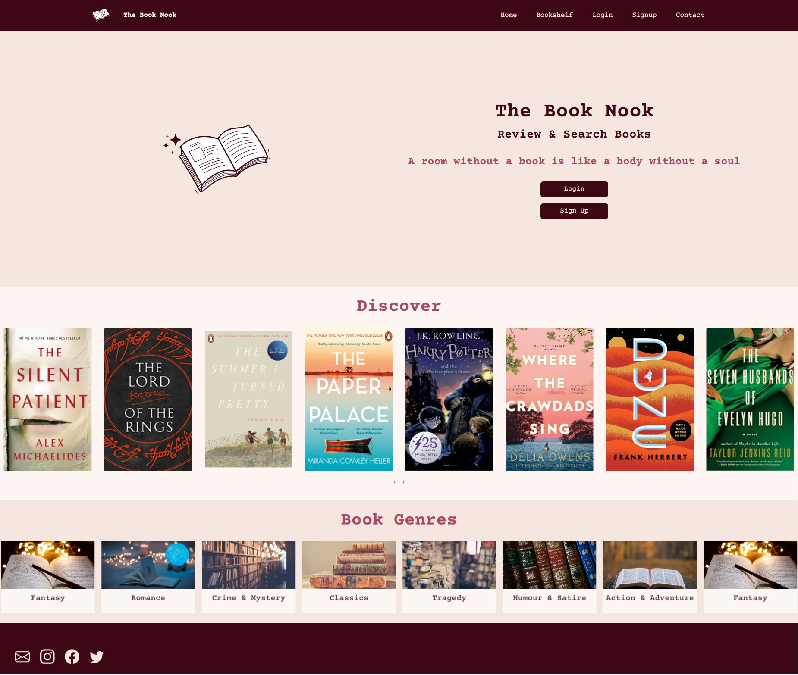

 

 * There is a large hero section to catch the user's eye. It includes the site logo, the site name, quote and a log in and signup button. If the user logs in, a welcome message appears, addressing the user by username and a button which links to the user's page (My Books).

  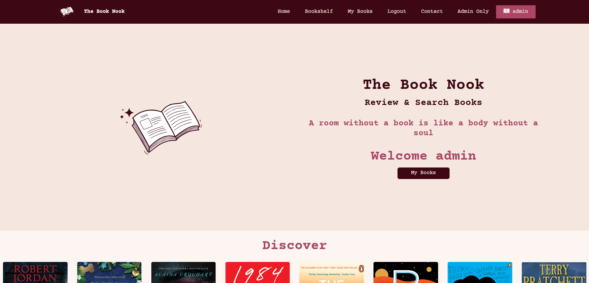

 * Below the hero section is a carousel of books, intending to entice the user. The section is called Discover, and draws from the entire database of approved books and those with uploaded book images, in random order. If the user clicks on a book, the link brings the user to that books' page.
 * Below this, there is a Genre section. This is the only place the Book genres can be accessed. If the user clicks on a book genre, the user is brought to a page with that genres books listed in only.
 * Each section is fully responsive.

 ### Genre Section

 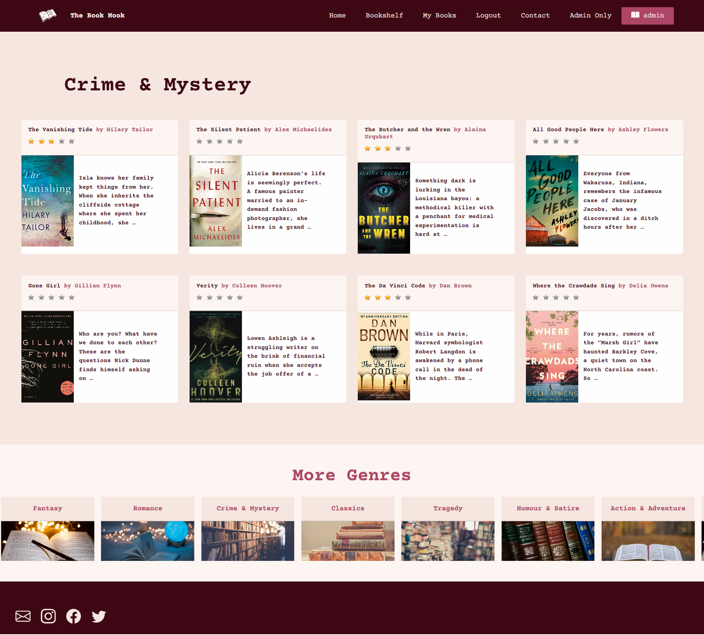

 * The Genre page can only be accessed by the user from the homepage and from within the genre page itself.
 * The page is specific to the genre you have clicked on and only contains approved books from that particular category.
 * The title and heading of the page is the specific category the user clicked on.
 * The books are listed, giving the user a preview of each, which the user can then click on to go to a specific book in more detail.
 * The user can also switch categories from within the page at the bottom.
 * The page is fully responsive.

 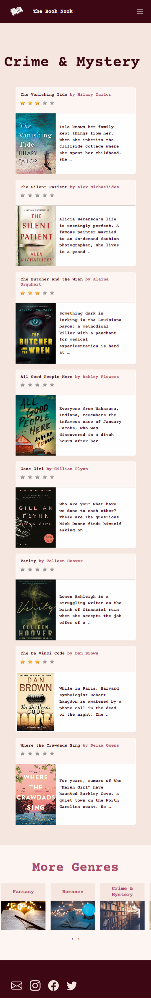

## Log In Page

  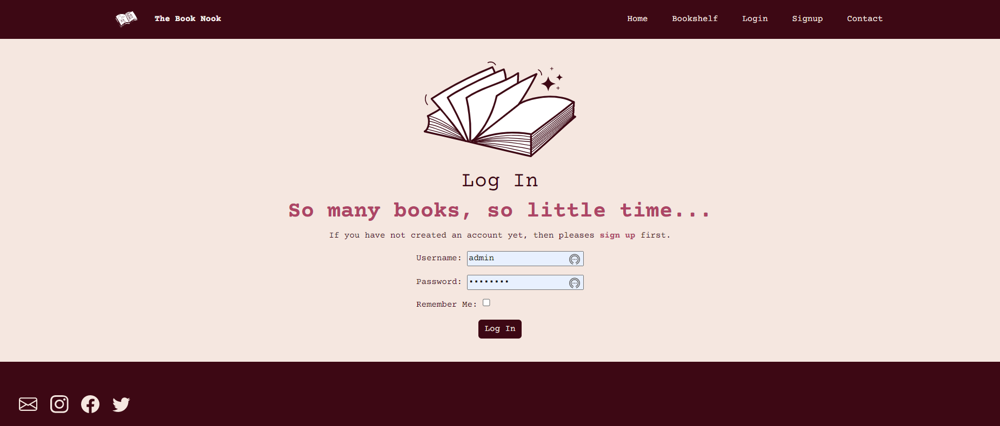

* The Log In page is accessed from either the navigation bar or a button on the homepage.
* The Log In page contains a link to the Sign Up page for the user who may have misclicked and needs to Sign Up rather than log in.
* It uses django-allauth to provide all the settings for user authentication.
* Styles are consistent with the rest of the website
* The page is fully responsive

## Sign Up Page

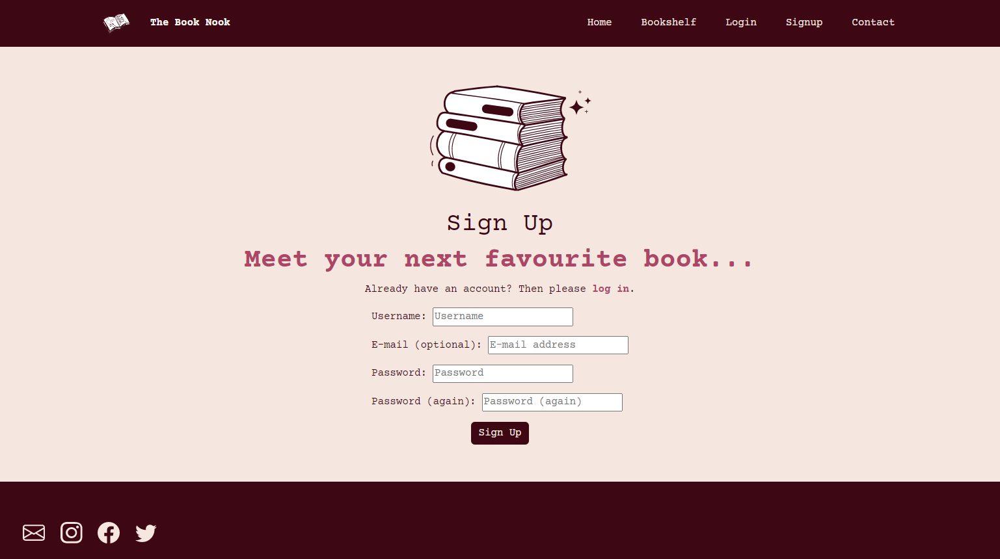

* The Sign Up page is accessed from either the navigation bar or a button on the homepage.
* The Sign Up page contains a link to the Log In page for the user who may have misclicked and already has an account.
* It uses django-allauth to provide all the settings for user authentication.
    * Unique username
    * Strength of password
* Styles are consistent with the rest of the website
* The page is fully responsive

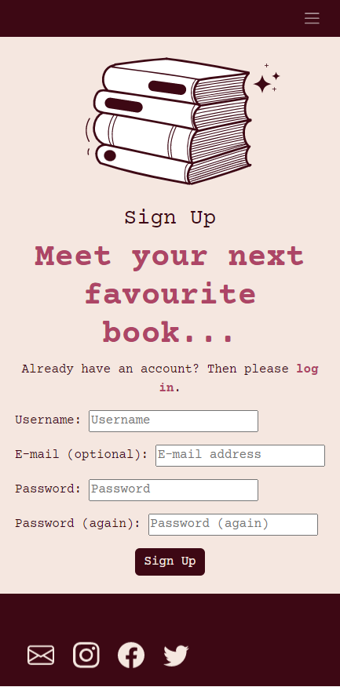

## Log Out Page

* The Log Out page can only be accessed from the navigation bar and only when the user is logged in.
* The Log Out page has a button for users to confirm they wish to log out.
* It uses django-allauth to provide all the settings for user authentication.
* Styles are consistent with the rest of the website
* The page is fully responsive

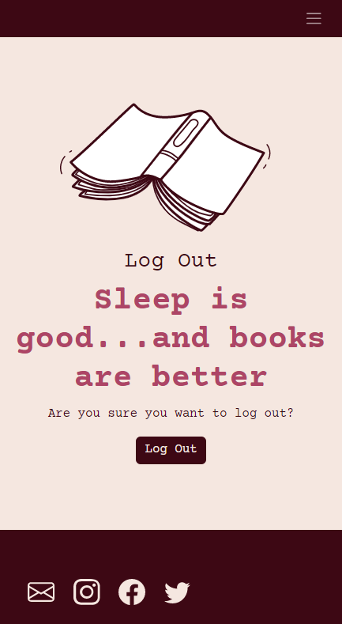

## Bookshelf Page

* The Bookshelf page can be accessed from the navigation bar. It can be accessed by both users who are and are not logged in.
* If the user is not logged in, the Add Book button is not available. You can only add books if you are logged in.

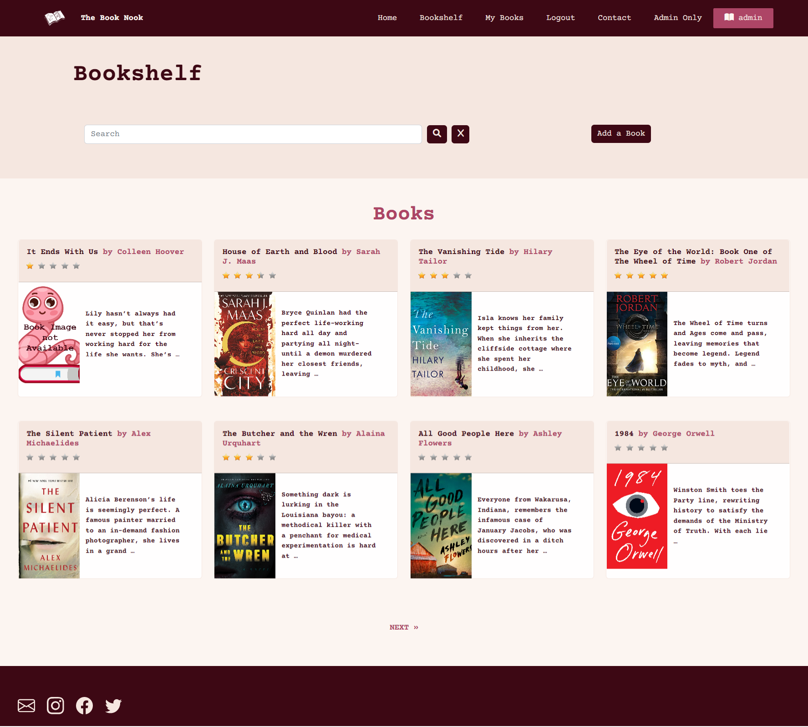

* There is a search function, which searches the approved books in the database using two parameters; Title and Author. The enter button on the keyboard and the search button on the website can be used to trigger the search. To exit the search function, the X button can be clicked.
* The Bookshelf contains a list of books that are approved and ordered by the date they were added. 
* In mobile view, just the book image can be seen and in desktop view the title, author and start of the book blurb can be seen.
* If a book is uploaded without an image, a placeholder image is set.
* The book list is paginated once 12 listings are onscreen.
* If a book listing is clicked, the user is brought to the Books' page.
* The page is fully responsive

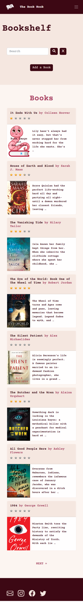

## Book Page

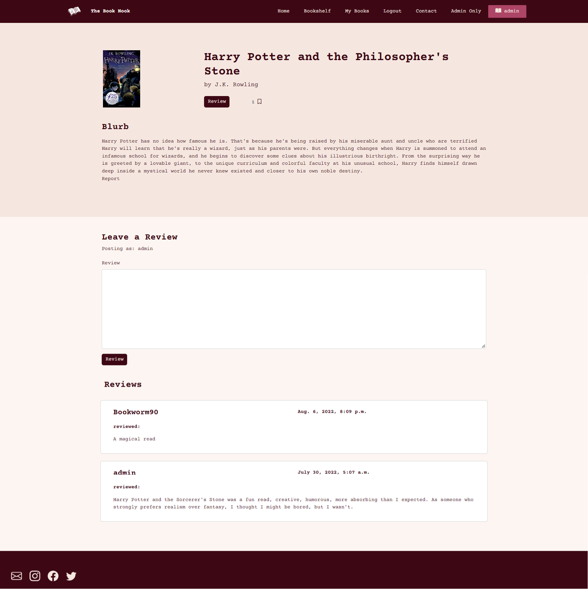

* The Book page is accessed by clicking on the links to particular books; mainly from the Bookshelf page, but can also be accessed via links from listings on the Home Page, and links from the review titles in My Books.
* The Book page is unique to each book listing, and a book has to be approved by admin to access it. 
* The url is unique for each book
* The Book page pulls data from the database about the chosen book; Book image, title, author and blurb.
* The user can bookmark (same concept as favouriting a book or item) and review a book if they are logged in.
* Below the book blurb, there is a list of all the reviews related to that particular book, in order of the newest ones.
* The user can only review a book if they are logged in.
* Each review, contains the username of who review, the time and date it was reviewed and the review text itself.
* The page is full responsive

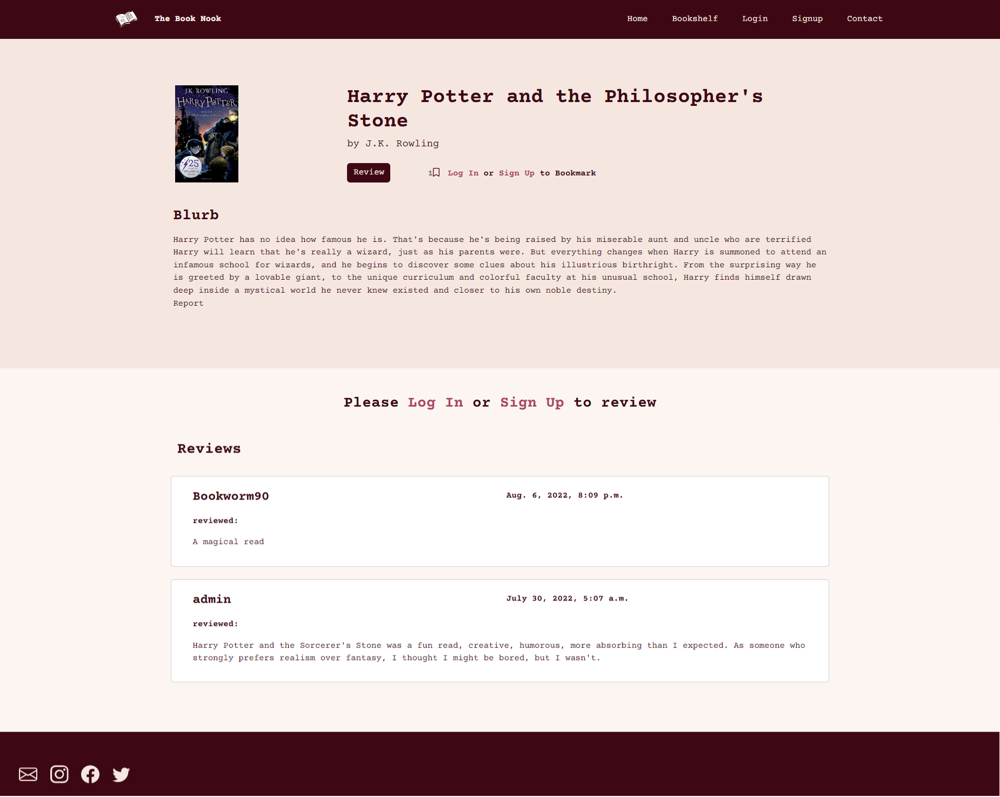

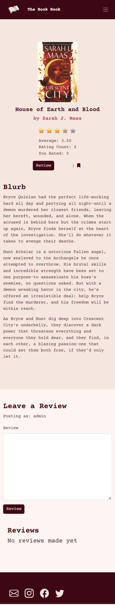

### Create a Review

* The user must be logged in to review a book

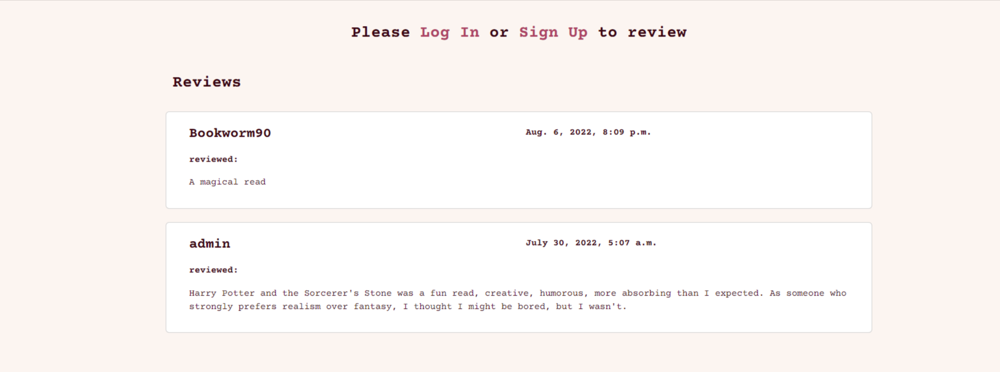

* If the user isn't logged in, text informs the user to log in to review.
* The review button at the top of the page brings the user to the review section at the bottom.
* Once the user reviews, they receive an alert that their review has been flagged for approval.

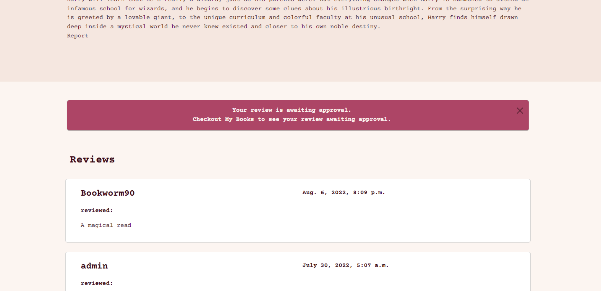

* Once the review is approved it will appear with the other reviews.

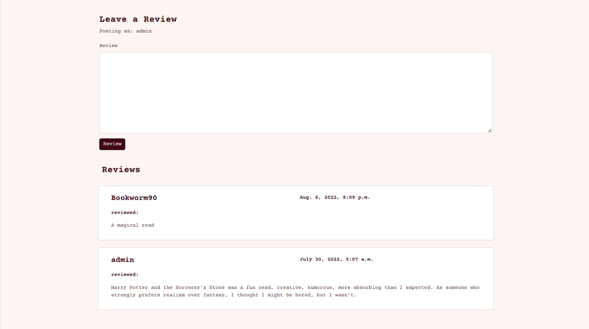

### Bookmark a Book

* The user must be logged into bookmark a book and if they arent, text informs the users of so and provides links to the log in and sign up pages.

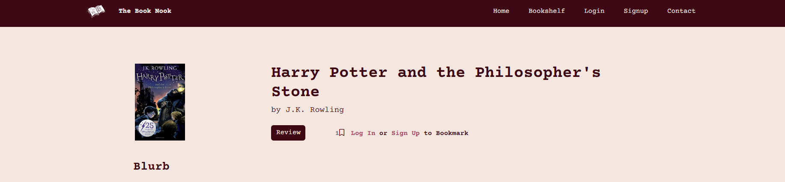

* Once the user logs in, they can click/press on the bookmark to bookmark the book.
* The bookmark itself fills color also to inform the user that they have bookmarked the book.
* The number beside the bookmark indicated how many people have bookmarked it already.
* A user can un-bookmark a book by clicking on the bookmark again.

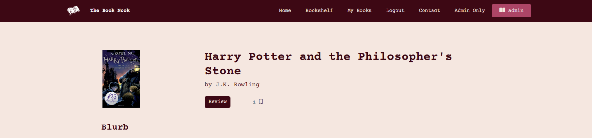

## My Books Page

 
 My Books Page Screenshot, Desktop and Mobile versions

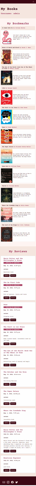

* My Books page can only be accessed if the user is logged in and can be accessed from the My Books tab in the navbar or clicking on the username in the navbar.
* The My Books page is essentially the user's profile page as such. It is personalised with the users name at the top, and contains a list of books bookmarked by the user and reviews made by the user.
* If a book that has been bookmarked by the user is clicked, it brings the user to the books detailed page.
* The page is fully responsive

### User Reviews

* The user can update or delete reviews they have already made here.
* Clicking the update button, brings the user to an edit review page where the user can change the content of their review.
* If the user decides to update their review, the review is removed from the Book's detail review list and is sent for approval by an admin again.
* The user is brought back to their My Books page and an alert notifies the user that they have updated their review and that it has been sent for approval.

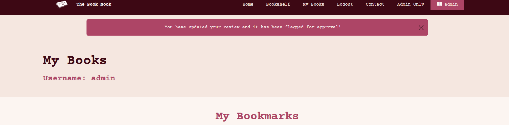

* The review itself will appear however in the user's My Books page but will contain a Waiting on Approval tag which is automatically removed if an admin approves the review.

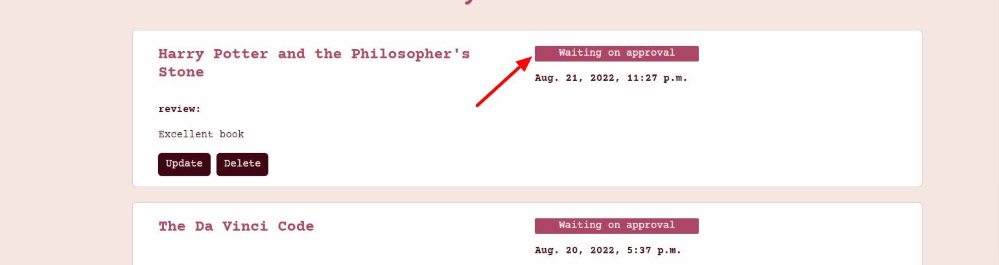

* If the admin deletes the review, the review is removed completely from all lists and cannot be accessed again and the user is brought back to their my books page and alerted that they deleted their review.

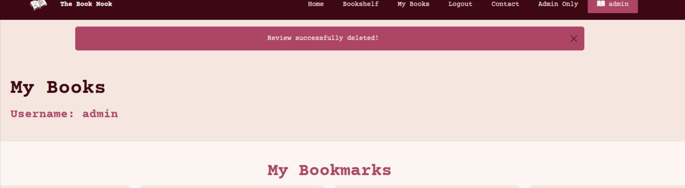

* If the user decides to delete their review, they are brought to a delete review page, where they are asked to confirm whether they wish to delete the review. If they decide to delete the review, the review is removed from all lists.

## Contact

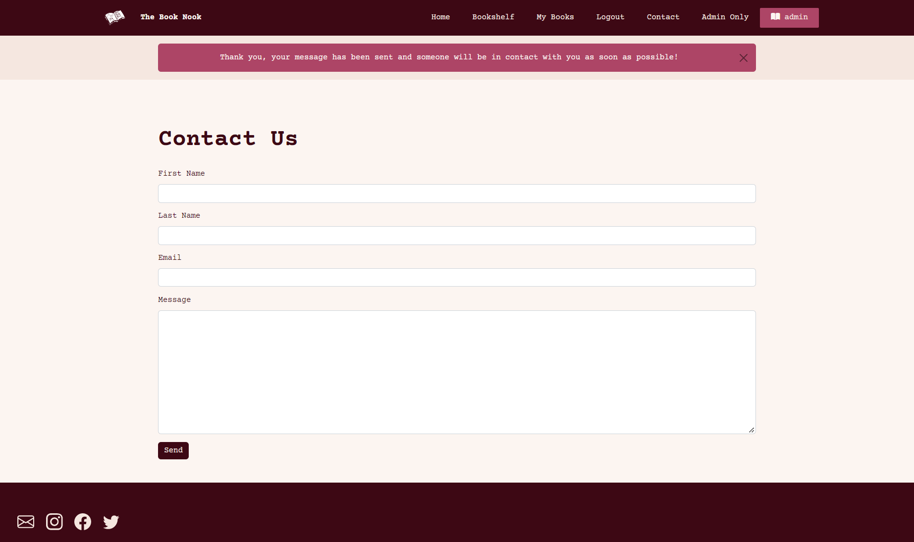

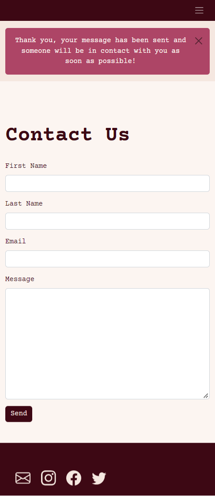

* The contact page can be accessed by all users, logged in or not.
* It uses EmailJS to send the user's message, contact details and name to an email address.

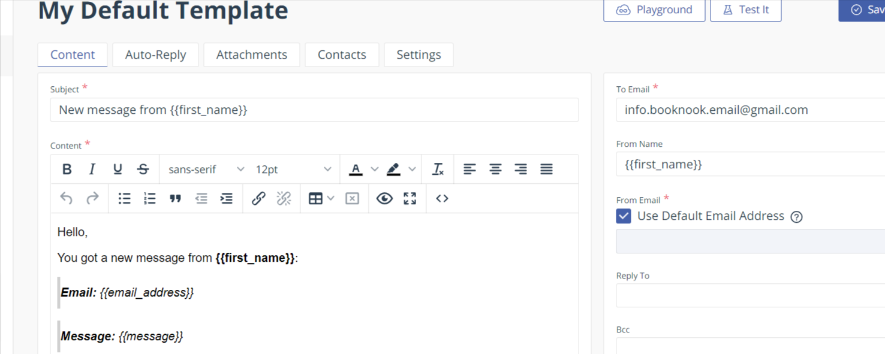

* All fields have to be filled by the user before sending the contact form.

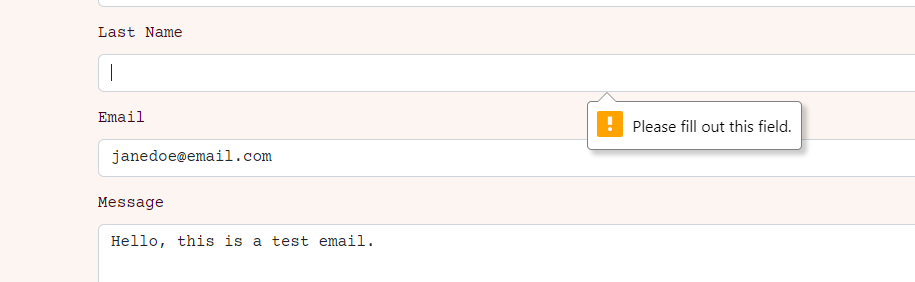

* If the user doesn't fill all the fields, a pop up will ask the user to please fill out the required field.
* The email field requires a proper email address with the @ symbol to be able to field the field correctly.

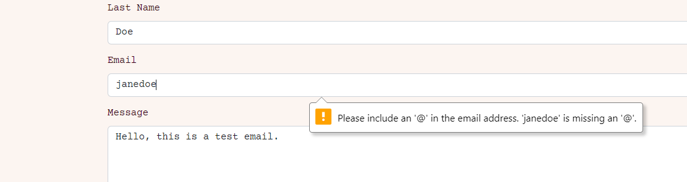

* Once the user sends the email an alert let's the user know that they have sent a message successfully and a message will be sent to the email chosen when setting up EmailJS

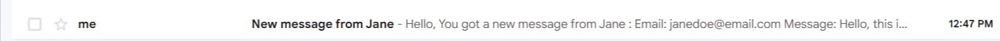

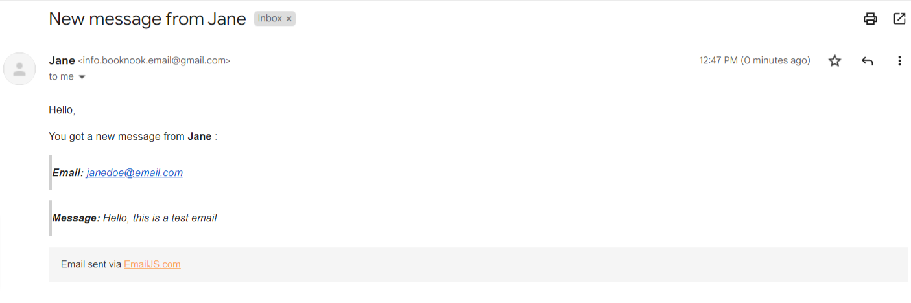

* The page is fully responsive

## Admin Only Page

 
 Admin Only Screenshot, Desktop and Mobile versions

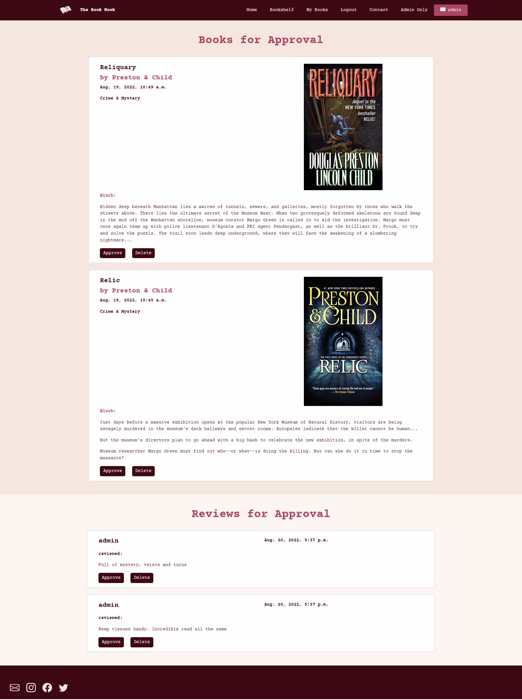

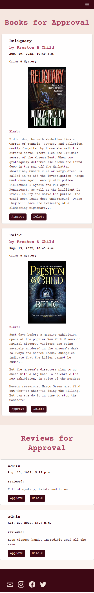

* The Admin Only page can only be accessed if the user is logged in and is a Superuser.
* It allows the admin to approve, edit and delete books and reviews from all users.
* There is a list of books in the database ordered by the newest, unapproved books.
* They are listed fully with title, author, book image, the book blurb, and the genre it was added to.
* There are two buttons to allow the admin to approve or delete each listing individually.
* The books paginate at 3 book listings
* Below this there is a list of reviews that are awaiting approval, ordered by the newest, unapproved reviews.
* The reviews are listed with the username of who made the review, the date and time it was made, the review text detail and two buttons to approve and delete the review.
* The page is fully responsive.

### Admin Approve and Delete Book

* The admin can approve and delete books added by users.
* If the admin decides to approve the listing they are brought to an approve book page where the admin can update the listing if need be (spelling mistakes etc), or submit it as is.

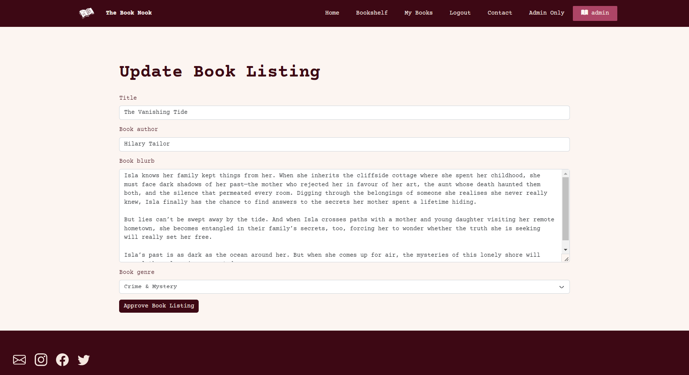

* Once the book is approved, it is removed from the list and it automatically appears as part of any list that shows approved books. The admin is brought back to the Admin Only page and a message alerts the admin that the book was approved.

* If the admin decides to delete the book, it is immediately deleted upon clicking of the delete button. 
* Once deleted the admin is brought back to the Admin Only page and a message alerts the admin that they have deleted the book.

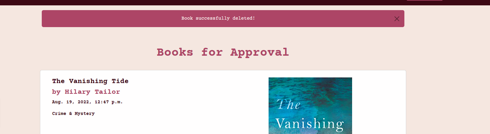

### Admin Approve and Delete Reviews

* The admin can approve and delete reviews added by users.
* If the admin decides to approve the review the review is immediately approved upon clicking the approve button.
* Once the review is approved, it is removed from the list and it automatically appears as part of any list that shows approved reviews. The admin is brought back to the Admin Only page and a message alerts the admin that the review was approved.

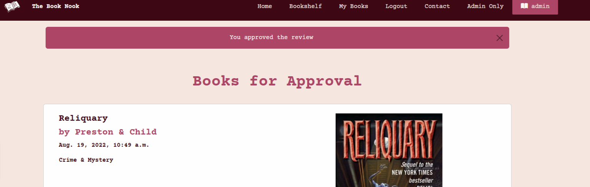

* If the admin decides to delete the review, it is immediately deleted upon clicking of the delete button. 
* Once deleted the admin is brought back to the Admin Only page and a message alerts the admin that they have deleted the review. The review is removed from the waiting for approval list and appears automatically on any lists calling for the approved reviews of a certain book.

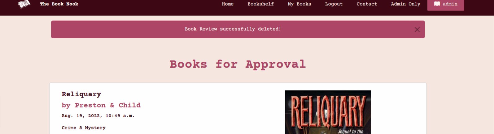

## 404 Page

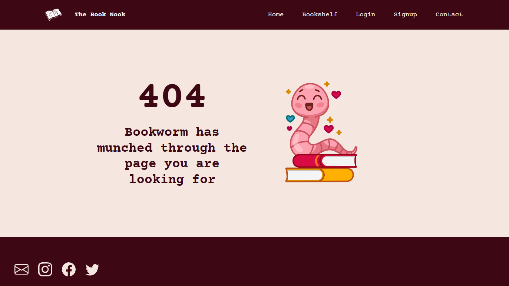

* A custom 404 page was created for any pages not found.
* This custom page allows the user to navigate back to website via the navbar if they click/type a url which causes a 404 error.
* The page has text and a cute image informing the user of their mistake.
* The page is fully responsive.

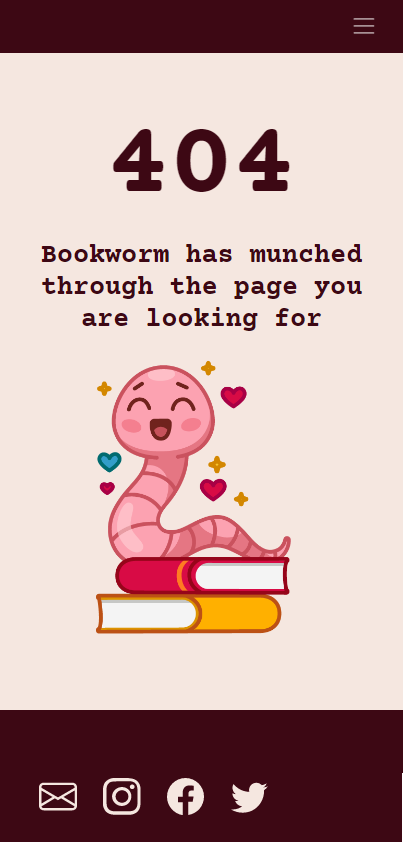

[Back to top](<#contents>)

# Future Features

## Book Genre

Currently the book genres play a small role on the website. The genre's themselves are already preset and the user just has to select the genre to go with the book. In the future the genre section would be a section all by itself. It would utilise a tag system, whereby books could have and be search for by multiple genres.

## Social Media Login

For ease of use, user's could use their social media credentials to log in, rather than creating another password to remember.

## Admin Specific Buttons

If an admin logs in, their would be admin only buttons on the book details page, allowing admin to update/delete books or reviews on the fly, if somehow mistakes or offensive material slipped passed the approval system, without having to go to the Admin Only page.

## More Detailed User Profile Page

The My Books page could be expanded  to include the ability of the user to add their bookmarked books in categories to organise them; for example, Read Again, or Must Read or Read.

The page could also provide more user details that could also be added to the user profile in general. Such as a profile picture or avatar that could be utilised in their reviews, and the total number of books they have reviewed or bookmarked could be visible on their profile.

[Back to top](<#contents>)

# Technologies Used

* HTML - Used to structure all the templates on the site
* CSS - to provide extra styling to the site
* Python - To provide functionality to the site. Packages used in the project can be found in requirements.txt
* Django - Python framework used in the project
* Heroku - Used to deploy the site publicly
* Heroku PostgreSQL - Used for the database during development and deployment
* Javascript - Minimum javascript was used, to initialise and set some settings for packages such as EmailJS and Owl Carousel
* Bootstrap 5.2.0 -  used for providing layouts and styling the html in the templates
* Font Awesome - All icons throughout the page
* Owl Carousel - Used to create a carousel on the home pages and genre pages of the site
* Adobe Illustrator - Used to edit any vectors or svgs for the project
* Figma - Used to create wireframes for the progect
* Diagram.net - Used to create Diagrams for the project
* Cloudinary - Used to host Static files for the site
* VSCode - Used to create, edit and compile the code for the program
* EmailJS - Used to enable the contact form functionality

[Back to top](<#contents>)

# Testing

I have included testing details in a separate document called [TESTING.md](TESTING.md)

[Back to top](<#contents>)

# Deployment

## Deployment to Heroku

## To fork the repository on GitHub

A copy of the GitHub Repository can be made by forking the GitHub account. Changes can be made on this copy without affecting the original repository.

1. Log in to GitHub and locate the repository in question.
2. Locate the Fork button which can be found in the top corner, right-hand side of the page, inline with the repository name.
3. Click this button to create a copy of the original repository in your GitHub Account.

## To clone the repository on GitHub

1. Click on the code button which is underneath the main tab and repository name to the right.
2. In the 'Clone with HTTPS' section, click on the clipboard icon to copy the URL.
3. Open Git Bash in your IDE of choice.
4. Change the current working directory to where you want the cloned directory to be made.
5. Type git clone, and then paste the URL copied from GitHub.
6. Press enter and the clone of your repository will be created.

[Back to top](<#contents>)

# Credits

* [Owl Carousel](https://owlcarousel2.github.io/OwlCarousel2/)
* [EmailJS](https://www.emailjs.com/)
* [Unique Constraint Info](https://stackoverflow.com/questions/56024059/django-uniqueconstraint)
* [Crispy Forms Fix](https://stackoverflow.com/questions/65133364/django-crispy-forms-is-not-working-correctly)
* [Fix Image upload via form](https://forum.djangoproject.com/t/image-does-not-save/4664/3)
* [Fix Image Upload via form link 2](https://stackoverflow.com/questions/53429359/django-form-valid-missing-1-required-positional-argument-form)
)
* [EmailJS tutorial](https://martinezjf2.medium.com/how-to-setup-emailjs-33809350f0f8)
* [Validation Error Fix for action attribute in forms](https://stackoverflow.com/questions/32491347/bad-value-for-attribute-action-on-element-form-must-be-non-empty)

[Back to top](<#contents>)

# Acknowledgements

This website, The Book Nook was designed and developed in conjunction with the Full Stack Software Developer Diploma course (eccommerce) at the Code Institute. I would like to thank my mentor, my cohort facilitator, the members of our cohort, the Slack community and Code Institute for all their support.

[Back to top](<#contents>)