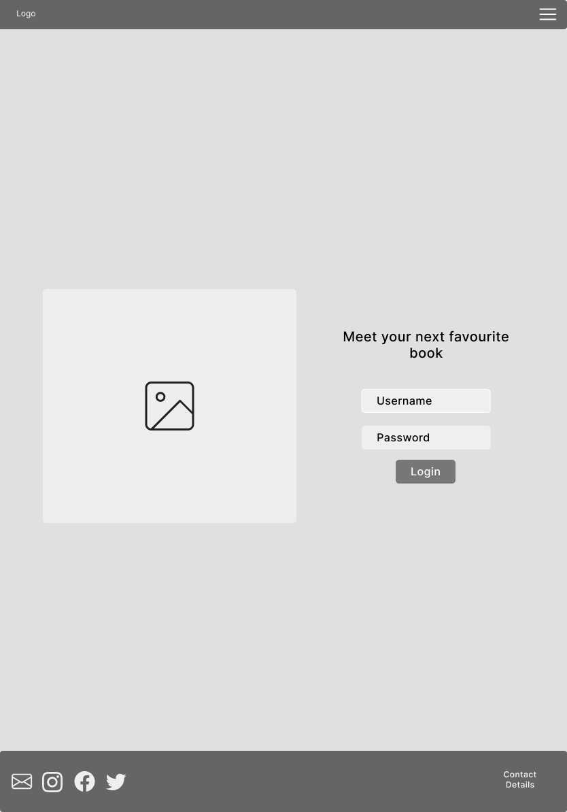
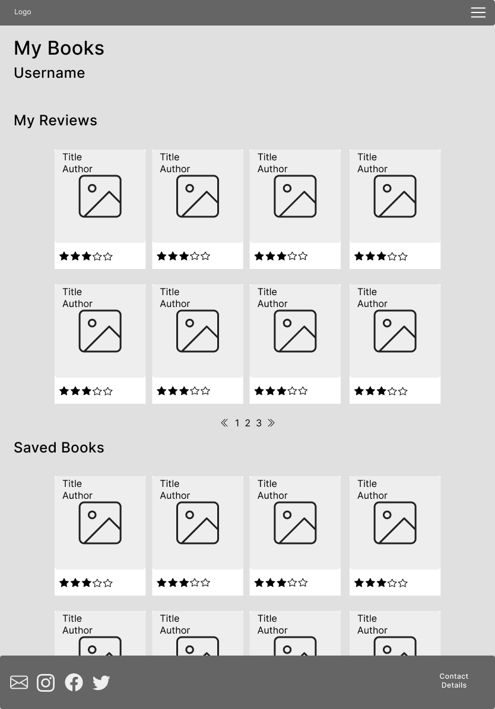

# **The Book Nook - Project Portfolio 4 - Javascript**

# Contents

* [Objective](<#objective>) 
* [User Experience](<#user-experience-ux>)
    * [Site Aims](<#site-aims>)
    * [User Stories](<#user-stories>)
    * [Design Wireframes](<#design-wireframes>)
    * [Site Structure](<#site-structure>)
    * [Design Choices](<#design-choices>)
* [Features](<#features>)
* [Future Features](<#future-features>)
* [Technologies Used](<#technologies-used>)
* [Testing](<#testing>)
* [Deployment](<#deployment>)
* [Credits](<#credits>)
* [Acknowledgements](<#acknowledgements>)

# Objective

[Back to top](<#contents>)

# User Experience (UX)

## Site Aims

## User Stories

## Design Wireframes

 
 Low fidelity mobile wireframes

 
 Low fidelity tablet wireframes

 
 Low fidelity Desktop wireframes

## Site Structure

## Design Choices

[Back to top](<#contents>)

# Features

[Back to top](<#contents>)

# Future Features

[Back to top](<#contents>)

# Technologies Used

[Back to top](<#contents>)

# Testing

[Back to top](<#contents>)

# Deployment

## Deployment to Heroku

## To fork the repository on GitHub

A copy of the GitHub Repository can be made by forking the GitHub account. Changes can be made on this copy without affecting the original repository.

1. Log in to GitHub and locate the repository in question.
2. Locate the Fork button which can be found in the top corner, right-hand side of the page, inline with the repository name.
3. Click this button to create a copy of the original repository in your GitHub Account.

## To clone the repository on GitHub

1. Click on the code button which is underneath the main tab and repository name to the right.
2. In the 'Clone with HTTPS' section, click on the clipboard icon to copy the URL.
3. Open Git Bash in your IDE of choice.
4. Change the current working directory to where you want the cloned directory to be made.
5. Type git clone, and then paste the URL copied from GitHub.
6. Press enter and the clone of your repository will be created.

[Back to top](<#contents>)

# Credits

[Back to top](<#contents>)

# Acknowledgements

[Back to top](<#contents>)