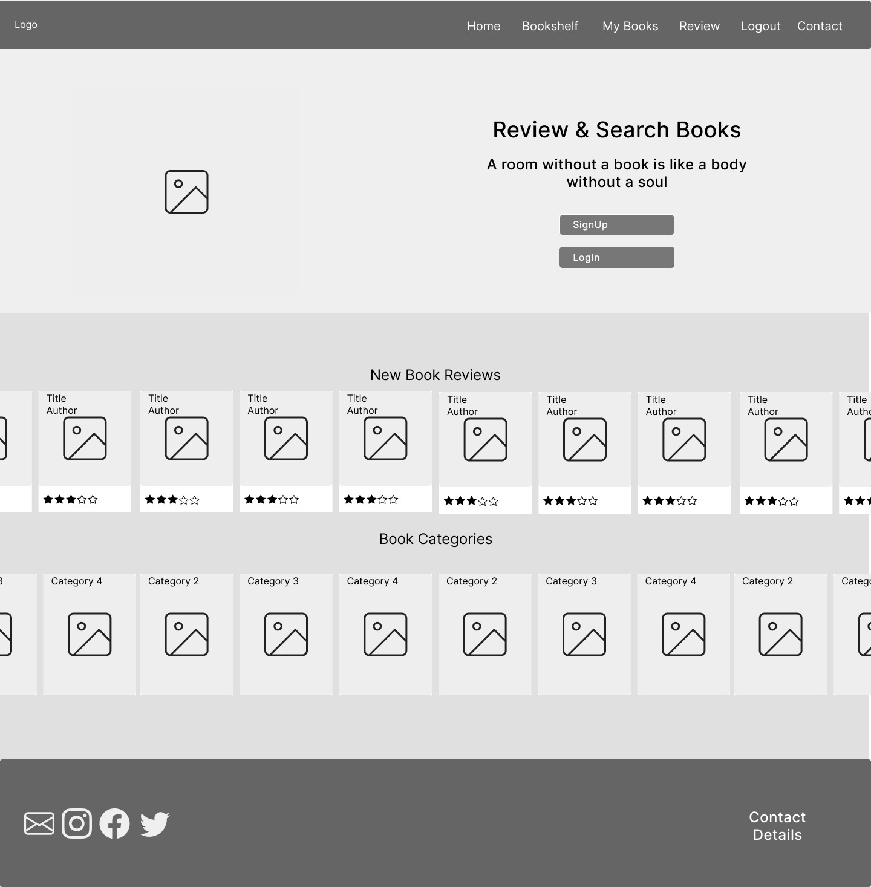

# **The Book Nook - Project Portfolio 4 **
The Book Nook is a Book Search and Review website, for users who would like to look up book reviews to help them decide their nexxt book, and in turn to leave reviews on books to help others.

You can view the live site here - <a href="https://rhi-book-nook.herokuapp.com/" target="_blank"> The Book Nook </a>

# Contents

* [Objective](<#objective>) 
* [User Experience](<#user-experience-ux>)
    * [Site Aims](<#site-aims>)
    * [Agile Methodology](<#agile-methodology>)
    * [Design Wireframes](<#design-wireframes>)
    * [Site Structure](<#site-structure>)
    * [Design Choices](<#design-choices>)
* [Features](<#features>)
* [Future Features](<#future-features>)
* [Technologies Used](<#technologies-used>)
* [Testing](<#testing>)
* [Deployment](<#deployment>)
* [Credits](<#credits>)
* [Acknowledgements](<#acknowledgements>)

# Objective

The aim of this site is to deliver an interactive website that users can engage with via a user log in system to acess a book database in which they can engage with to leave and edit their reviews, search books, bookmark their favourite books, and upload books that may not be in the database.

[Back to top](<#contents>)

# User Experience (UX)

## Site Aims

* To provide the user with a website that allows them to view book listings and reviews
* To allow the user the user to create, update and delete reviews
* To allow the user to add a book listing if the book listing isn't already in the database
* To provide the admin user with the ability to approve, update and delete book listings and reviews in the frontend
* To provide a clear and appropriate response to any user inputs or actions

## Agile Methodology

The Agile Methodology was used to plan this project. This was implemented through Github and the Project Board which can be seen here -  <a href="https://github.com/users/rhiannonmcn/projects/6" target="_blank"> The Book Nook Project </a>

Through the use of the Kanban board in the projects view in Github, the project was divived into a few different sections:
* Backlog
* Current Iteration
* In Progress
* Done

Github issues were used to create User Stories and any other Fixes or Updates for the project. This was where the project user was assigned, labels were added to provide clarity, and the story was added to the appropriate Iteration and the project. Each User Story, Fix or Update had a clear title, acceptance criteria and smaller tasks (if appropriate). 

Milestones were used to create Iterations. There were 3 Iterations each dated appropriately. User Stories were completed based on the current Iteration that was in progress. Each Iteration was completed on time.

Development branches were used to complete User Stories. This offered a greater level of control in developing the various aspects of the website. Certain User Stories could also be grouped together and worked on in one development branch. Once the User Stories were completed within the branch and the deveoplment branch was up to date with code pushed, a pull request was created. Using the **Closes #User-Story-number** keyword, the various in progress User Story issues that were being worked on would automatically be closed when the pull request was merged with the main branch. The development branch would then be deleted and a new one created with a new set of user story/ies to be worked on.

### User Stories

**Iteration 1**
* As a **user**  I can **easily see the purpose of this website on the home page** so that **I can easily navigate it**
* As a **user**  I can **view a list of book genres** so that **so that I can see a list of book reviews in a genre I am currently in**
* As a **user**  I can **view a paginated list of books* so that **I can view book reviews easily**
* As a **user**  I can **save books** so that **that I can have a list of books I want to read in the future**
* As a **user**  I can **create a review for a book** so that **so that I can let other's know what I thought of the book**
* As a **site admin**  I can **add a book listing** so that **users can review a book that isn't already on the website**
* As a **user**  I can **see a list of books already reviewed by all users** so that **I can find a new book to read**
* As a **user**  I can **register an account** so that **so that I can review books I have read and save books I want to read**
* As a **user**  I can **choose the category for a book I upload** so that **the book is easily searchable**
* As a **site admin**  I can **approve or decline reviews and book listings made** so that **I can filter out ingenuine reviews or duplicate book records**

**Iteration 2**
* As a **user**  I can **fill out a contact form** so that **so that I can easily contact**
* As a **user**  I can **update and delete reviews I have already made** so that **I can have control over content I have posted**
* As a **user**  I can **save books** so that **I can easily see books of interest to me**
* As a **user**  I can **see my book reviews, username and liked books on a profile page** so that **I can easily keep track of my activity on the site**
* As a **user**  I can **see reviews I have made** so that **I can edit, update or delete my reviews**
* As a **user**  I can **search the website for books** so that **so I can easily find book lisitings**
* As a **user**  I can **add book listings** so that **review a book that isn't already in the database**

**Iteration 3**
* As a **site admin**  I can **access book listings and reviews to be approved** so that **I can approve or not approve and delete user uploads**
* As a **user**  I can **see if I navigate to a wrong page on the website** so that **navigate easily back via the navbar**

## Design Wireframes

 
 Low fidelity mobile wireframes

 
 Low fidelity tablet wireframes

 
 Low fidelity Desktop wireframes

## Database Schema

## Site Structure

The Book Nook website consists of 5 pages visible from the navigation bar, the categories page which is only accessible from the home page and with another form page only acessible by adding a book to the database. 

The Home page, Bookshelf, Login, Signup and Contact pages can be accessed by all users. Once a user logs in or signsup they have access to the My Books page. The Signup page is removed from the navbar once the user logs in and the log in page is changed to a log out page.

## Design Choices

### Color Scheme
The final color scheme chosen was a rich dark red with warm cream whites and a magenta and bright purple used as highlights. The main colors were chosen after a lot of research into colors associated with books and reading, with the rich red a color often used in valuable, rich and old books and the cream whites a nod to the parchment color of the pages of books. The magenta and purple colors modernise it a bit

### Typography

One font was chosen for this website and that was Courier Prime. Courier Prime is a serif font that looks like a typewriter font, again a nod to the printed word in books.

This gives a very vintage feel to the project but ties in nicely with the color scheme and theme and with the use of letter spacing it slightly modernises the look of the font.

[Back to top](<#contents>)

# Features

The Book Nook was created to produce an interactive experience for the user through the use of both design and site structure.  It is designed and structured like a typical website, making it very natural and intuitive to use to entice the user to explore further.

Each page, except the Home Page, has a clear heading when landing on the page. The language, colour and design used is intended to be friendly and easy to understand, and reflective of the website theme.

## Navigation

* The site navigation is done through the navigation bar at the top of each page and this does not change in style throughout the user's navigation of the website.
* Tabs on the navigation bar change depending on whether the user is logged in or not, or is an admin or not. 

    

    * If the user logs in or signs up, those two tabs are removed to be replaced with a log out tab.

    

    * Once the user logs in or signs up, a completely new tab appears called My Books, which is essentially the users page

    

    * If the user is a superuser and logs in, there is an Admin Only tab that appears that is only accessible to superusers that log in.

    

* If the user is logged in, their username is reflected on the top right of the navbar, indicating to the user that they are logged in, and links to that users page (My Books).

## Home Screen

## Log In Page

## Sign Up Page

## Log Out Page

## Bookshelf Page

### Create a Review

### Bookmark a Book

## My Books Page

### Update Review

### Delete a Review

## Contact

## Admin Only

### Admin Approve Book

### Admin Delete Book

### Admin Approve Review

### Admin Delete Review

## 404 Page

[Back to top](<#contents>)

# Future Features

[Back to top](<#contents>)

# Technologies Used

[Back to top](<#contents>)

# Testing

[Back to top](<#contents>)

# Deployment

## Deployment to Heroku

## To fork the repository on GitHub

A copy of the GitHub Repository can be made by forking the GitHub account. Changes can be made on this copy without affecting the original repository.

1. Log in to GitHub and locate the repository in question.
2. Locate the Fork button which can be found in the top corner, right-hand side of the page, inline with the repository name.
3. Click this button to create a copy of the original repository in your GitHub Account.

## To clone the repository on GitHub

1. Click on the code button which is underneath the main tab and repository name to the right.
2. In the 'Clone with HTTPS' section, click on the clipboard icon to copy the URL.
3. Open Git Bash in your IDE of choice.
4. Change the current working directory to where you want the cloned directory to be made.
5. Type git clone, and then paste the URL copied from GitHub.
6. Press enter and the clone of your repository will be created.

[Back to top](<#contents>)

# Credits

[Back to top](<#contents>)

# Acknowledgements

[Back to top](<#contents>)